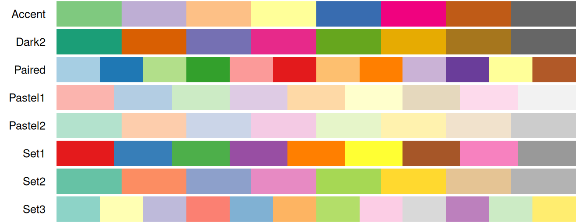
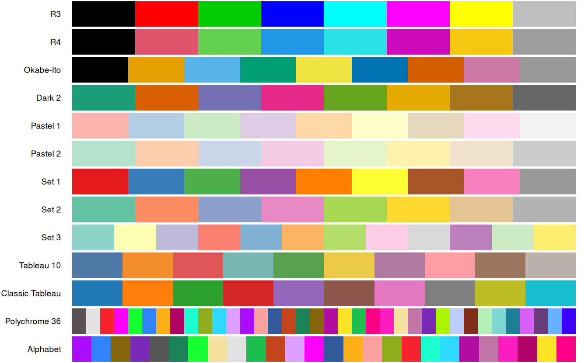
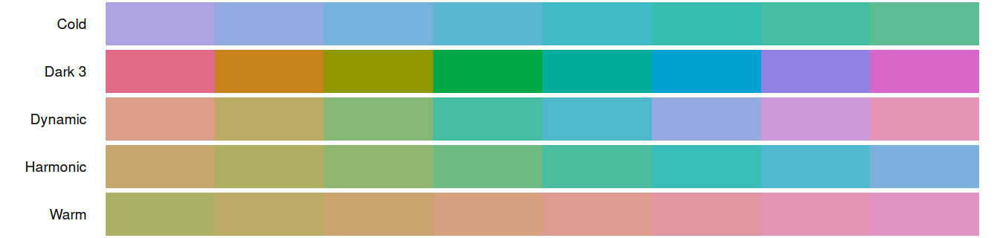
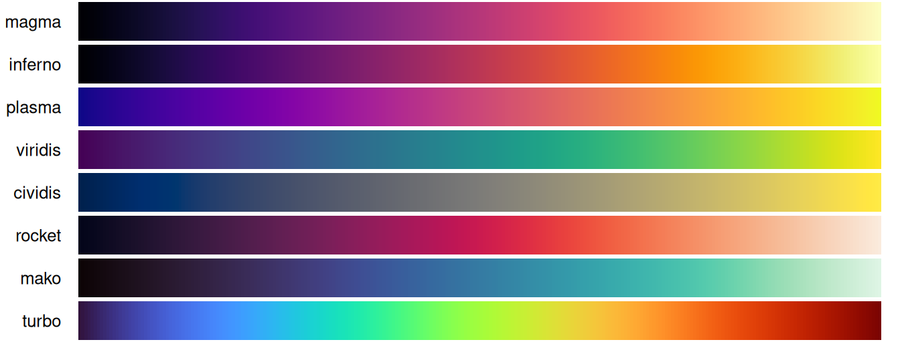
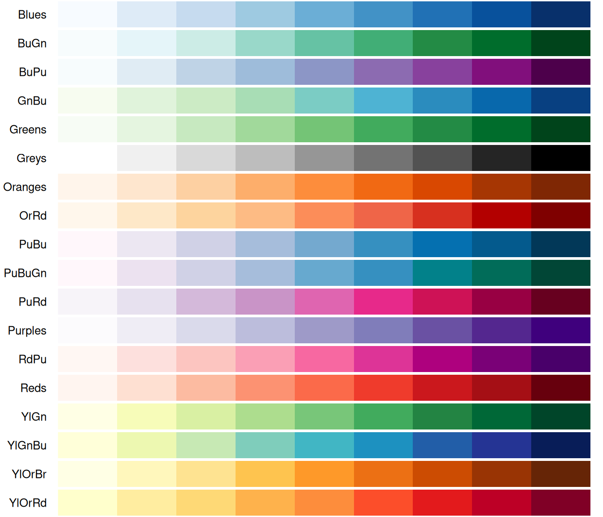
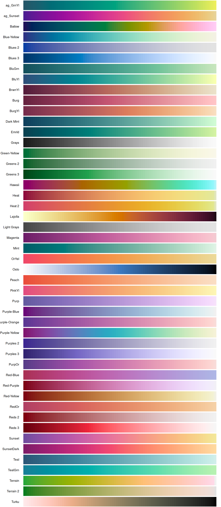
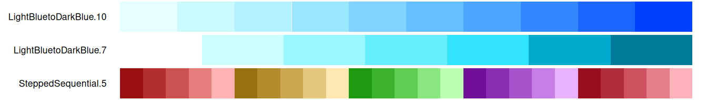
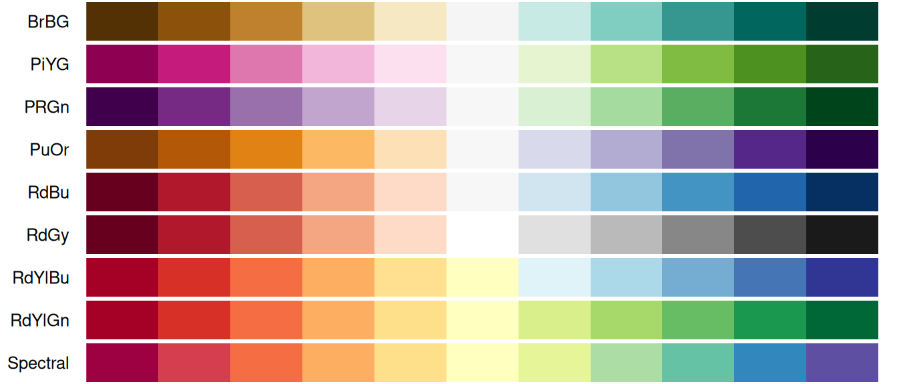
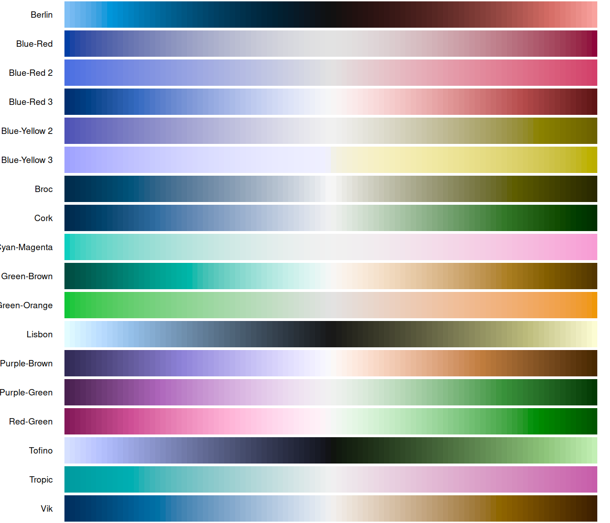
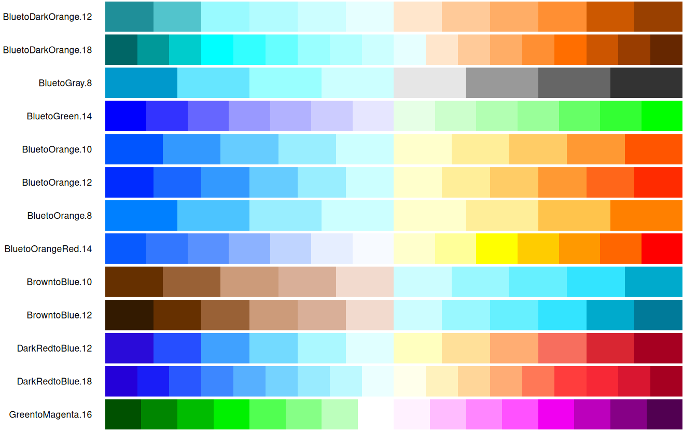

# Available Color Palettes

{scales} makes 155 color palettes available to packages like {ggplot2},
which references them using the `palette` argument of
`scale_*_discrete()`, `scale_*_continuous()`, and `scale_*_binned()`
functions.

This article groups every built-in name by the use it’s best suited for:
as a **discrete** palette for unordered categories or as a
**continuous** palette for magnitude data (sequential or diverging).

Palette names

**Discrete:** `"Alphabet"`, `"Classic Tableau"`, `"Dark 2"`,
`"ggplot2"`, `"Okabe-Ito"`, `"Pastel 1"`, `"Pastel 2"`,
`"Polychrome 36"`, `"R3"`, `"R4"`, `"Set 1"`, `"Set 2"`, `"Set 3"`,
`"Tableau 10"`, `"Accent"`, `"Dark2"`, `"Paired"`, `"Pastel1"`,
`"Pastel2"`, `"Set1"`, `"Set2"`, `"Set3"`, `"Categorical.12"`, `"hue"`,
`"Cold"`, `"Dark 3"`, `"Dynamic"`, `"Harmonic"`, `"Warm"`

**Sequential:** `"Blues"`, `"BuGn"`, `"BuPu"`, `"GnBu"`, `"Greens"`,
`"Greys"`, `"Oranges"`, `"OrRd"`, `"PuBu"`, `"PuBuGn"`, `"PuRd"`,
`"Purples"`, `"RdPu"`, `"Reds"`, `"YlGn"`, `"YlGnBu"`, `"YlOrBr"`,
`"YlOrRd"`, `"LightBluetoDarkBlue.10"`, `"LightBluetoDarkBlue.7"`,
`"SteppedSequential.5"`, `"grey"`, `"ag_GrnYl"`, `"ag_Sunset"`,
`"Batlow"`, `"Blue-Yellow"`, `"Blues 2"`, `"Blues 3"`, `"BluGrn"`,
`"BluYl"`, `"BrwnYl"`, `"Burg"`, `"BurgYl"`, `"Dark Mint"`, `"Emrld"`,
`"Grays"`, `"Green-Yellow"`, `"Greens 2"`, `"Greens 3"`, `"Hawaii"`,
`"Heat"`, `"Heat 2"`, `"Lajolla"`, `"Light Grays"`, `"Magenta"`,
`"Mint"`, `"OrYel"`, `"Oslo"`, `"Peach"`, `"PinkYl"`, `"Purp"`,
`"Purple-Blue"`, `"Purple-Orange"`, `"Purple-Yellow"`, `"Purples 2"`,
`"Purples 3"`, `"PurpOr"`, `"Red-Blue"`, `"Red-Purple"`, `"Red-Yellow"`,
`"RedOr"`, `"Reds 2"`, `"Reds 3"`, `"Sunset"`, `"SunsetDark"`, `"Teal"`,
`"TealGrn"`, `"Terrain"`, `"Terrain 2"`, `"Turku"`, `"cividis"`,
`"inferno"`, `"magma"`, `"mako"`, `"plasma"`, `"rocket"`, `"turbo"`,
`"viridis"`

**Diverging:** `"BrBG"`, `"PiYG"`, `"PRGn"`, `"PuOr"`, `"RdBu"`,
`"RdGy"`, `"RdYlBu"`, `"RdYlGn"`, `"Spectral"`, `"BluetoDarkOrange.12"`,
`"BluetoDarkOrange.18"`, `"BluetoGray.8"`, `"BluetoGreen.14"`,
`"BluetoOrange.10"`, `"BluetoOrange.12"`, `"BluetoOrange.8"`,
`"BluetoOrangeRed.14"`, `"BrowntoBlue.10"`, `"BrowntoBlue.12"`,
`"DarkRedtoBlue.12"`, `"DarkRedtoBlue.18"`, `"GreentoMagenta.16"`,
`"Berlin"`, `"Blue-Red"`, `"Blue-Red 2"`, `"Blue-Red 3"`,
`"Blue-Yellow 2"`, `"Blue-Yellow 3"`, `"Broc"`, `"Cork"`,
`"Cyan-Magenta"`, `"Green-Brown"`, `"Green-Orange"`, `"Lisbon"`,
`"Purple-Brown"`, `"Purple-Green"`, `"Red-Green"`, `"Tofino"`,
`"Tropic"`, `"Vik"`

## Discrete palettes

Discrete palettes assign a distinct color to each category,
e.g. `scale_color_discrete(palette = "Set2")`. These come from four
sources: HCL’s qualitative palettes, base R’s fixed categorical sets,
Brewer’s qualitative palettes, and one dichromat palette built
specifically for categories (plus ggplot2’s own default, `"hue"`). Where
a name is shared across sources, the last-registered palette name takes
precedence; for instance, `"Blues"` exists in both the HCL and Brewer
families, but {scales} only returns the Brewer version of `"Blues"`.

Brewer’s qualitative palettes:

Base R’s fixed categorical sets
([`grDevices::palette.pals()`](https://rdrr.io/r/grDevices/palette.html),
R \>= 4.0.0 only), including familiar defaults like `"R3"` and `"R4"`,
alongside color-vision-deficiency-aware sets such as `"Okabe-Ito"`:

HCL’s qualitative palettes, generated from a continuous hue rotation
rather than a fixed set of hand-picked colors (shown here at `n = 8`;
requesting many more levels than that can produce hues that are
difficult to distinguish):

One more standalone discrete palette: ggplot2’s default `"hue"` palette:

Dichromat’s single qualitative palette:

Many of these palettes have a fixed, limited number of colors.
Requesting more colors than a palette contains will recycle values (for
the fixed sets) or produce increasingly similar hues (for HCL’s
qualitative palettes and for ggplot2’s `"hue"` palette), so these are
best suited to categorical data with a known, modest number of levels.

## Continuous palettes

Continuous palettes map a numeric range onto a smooth color gradient,
e.g. `scale_color_continuous(palette = "viridis")`. These split
naturally into two subtypes: **sequential** palettes for data that
increases in magnitude from a natural minimum, and **diverging**
palettes for data that departs from a meaningful midpoint (often zero).
Sequential and diverging palettes can also be used with binned scales,
which quantize the continuous palette into discrete steps.

### Sequential

The viridis family: perceptually uniform, color-blind friendly
gradients, and a strong general-purpose default:

Brewer’s sequential palettes:

HCL’s sequential palettes — by far the largest family, including several
scientific color maps (`"Batlow"`, `"Hawaii"`, `"Turku"`, `"Lajolla"`)
alongside classics like `"Heat"` and `"Terrain"`:

Dichromat’s two color-safe ramps and its unique stepped-sequential ramp:

And a plain greyscale ramp, useful whenever color needs to be avoided or
reserved for another variable:

### Diverging

Brewer’s diverging palettes:

HCL’s diverging palettes:

Dichromat’s color-blind-safe diverging palettes:

